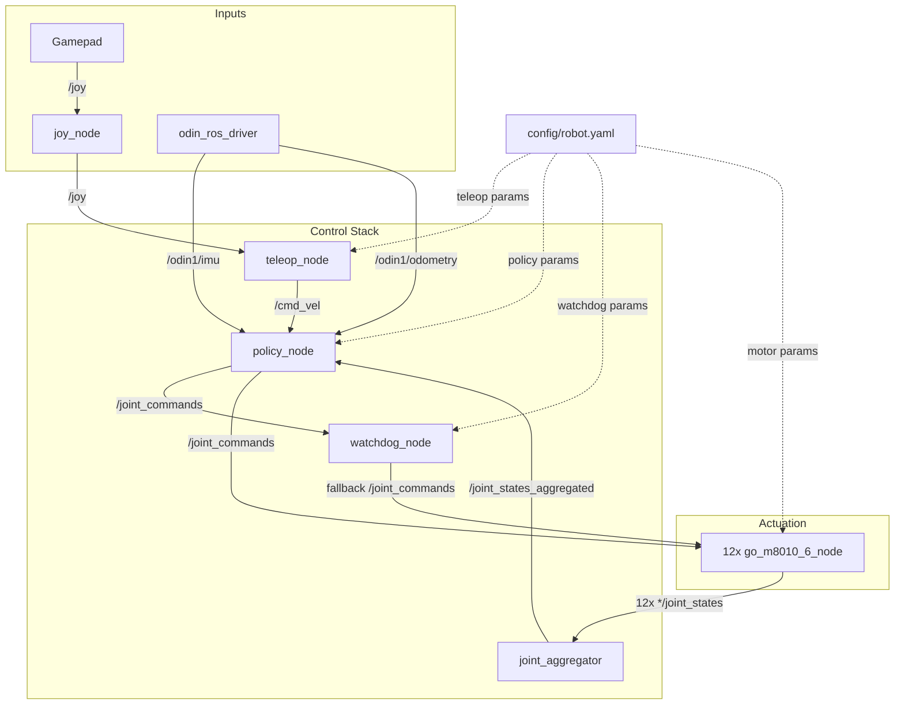

# legged_ws

ROS 2 Humble workspace for a quadruped robot stack built around three packages:

- `src/legged_control` - locomotion, teleop, calibration, watchdog
- `src/unitree_actuator_sdk` - Unitree GO-M8010-6 motor ROS 2 wrapper
- `src/odin_ros_driver` - Odin1 LiDAR / odometry driver

## Architecture



Data flow, in plain words:

- Gamepad input goes through `joy_node` into `teleop_node`, which publishes `/cmd_vel`.
- `policy_node` combines `/cmd_vel`, LiDAR odometry / IMU, and aggregated joint states to compute `/joint_commands`.
- `watchdog_node` monitors `/joint_commands` and injects safe defaults if the policy stops publishing.
- The 12 motor nodes execute commands and publish per-joint state, which `joint_aggregator` merges back into `/joint_states_aggregated`.
- `config/robot.yaml` provides shared configuration for teleop, policy, watchdog, and motor nodes.

## Package Layout

```text
src/
  legged_control/
    legged_control/
      joint_aggregator.py
      teleop_node.py
      policy_node.py
      watchdog_node.py
      calibration/
    launch/locomotion.launch.py
    config/robot.yaml
    tests/calibration/

  unitree_actuator_sdk/
    unitree_motor_ros2/go_m8010_6_node.py
    launch/all_motors.launch.py

  odin_ros_driver/
    src/host_sdk_sample.cpp
    src/pcd2depth_ros2.cpp
    src/cloud_reprojection_ros.cpp
    launch_ROS2/odin1_ros2.launch.py
```

## Main Nodes

### `legged_control`

- `joint_aggregator` - merges 12 motor joint-state topics into `/joint_states_aggregated`
- `teleop_node` - converts `/joy` into `/cmd_vel`
- `policy_node` - builds observations and publishes `/joint_commands`
- `watchdog_node` - republishes safe default joint targets if policy output stops
- `scripts/calibrate.py` - interactive calibration workflow

### `unitree_actuator_sdk`

- `go_m8010_6_node` - one motor node per joint, subscribes to `/joint_commands`, publishes joint state

### `odin_ros_driver`

- `host_sdk_sample` - main Odin ROS driver executable
- `pcd2depth_ros2_node` - point-cloud to depth image utility
- `cloud_reprojection_ros2_node` - cloud reprojection utility

## Quick Start

Source ROS first:

```bash
source /opt/ros/humble/setup.bash
```

Build the workspace:

```bash
colcon build
source install/setup.bash
```

Launch the full locomotion stack:

```bash
ros2 launch legged_control locomotion.launch.py
```

Launch without LiDAR:

```bash
ros2 launch legged_control locomotion.launch.py with_lidar:=false
```

## Hand Controller Only

If you only want to inspect joystick axes/buttons:

```bash
source /opt/ros/humble/setup.bash
ros2 run joy joy_node
```

In another terminal:

```bash
source /opt/ros/humble/setup.bash
ros2 topic echo /joy
```

Teleop mapping lives in `src/legged_control/config/robot.yaml`:

- `teleop.axis_vx`
- `teleop.axis_vy`
- `teleop.axis_yaw`
- `teleop.invert_vx`
- `teleop.invert_vy`
- `teleop.invert_yaw`
- `teleop.btn_emergency_stop`

## Useful Commands

Build one package:

```bash
colcon build --packages-select legged_control
colcon build --packages-select unitree_actuator_sdk
colcon build --packages-select odin_ros_driver
```

Run only teleop for joystick mapping validation:

```bash
ros2 run joy joy_node
ros2 run legged_control teleop_node
ros2 topic echo /cmd_vel
```

Run calibration tests:

```bash
python3 -m pytest src/legged_control/tests/calibration -v
```

Run one test file:

```bash
python3 -m pytest src/legged_control/tests/calibration/test_phase3_logic.py -v
```

Run one test case:

```bash
python3 -m pytest src/legged_control/tests/calibration/test_phase3_logic.py::test_suggest_kd_increase_on_overshoot -v
```

## Configuration

Primary robot configuration file:

- `src/legged_control/config/robot.yaml`

It contains:

- joint names, IDs, defaults, and limits
- control gains and loop rates
- teleop axis/button mapping
- policy model path and normalization

## Notes

- `legged_control` and `unitree_actuator_sdk` are `ament_python` packages.
- `odin_ros_driver` is an `ament_cmake` package with ROS1/ROS2 compatibility logic.
- Motor and LiDAR launch paths may access real hardware; avoid running them unless devices are connected.
- The calibration flow updates `robot.yaml`, including emergency-stop button binding.

## Related Files

- Agent instructions: `AGENTS.md`
- Full locomotion launch: `src/legged_control/launch/locomotion.launch.py`
- Motor-only launch: `src/unitree_actuator_sdk/launch/all_motors.launch.py`
- Odin driver docs: `src/odin_ros_driver/README.md`
